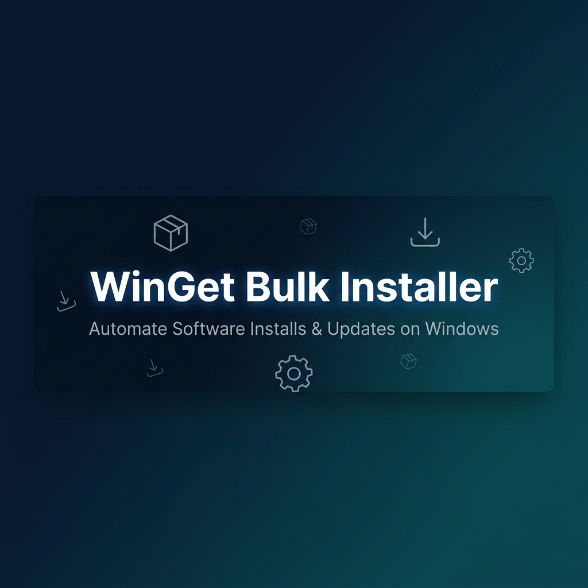

<p align="center">
  
</p>

<h1 align="center">🛠️ WinGet Bulk Installer</h1>

<p align="center">
  <strong>Automate bulk software installs & updates on Windows with WinGet + PowerShell</strong>
</p>

<p align="center">
  <a href="#-quick-start"></a>
  <a href="#-scripts-reference"></a>
  <a href="#-automate-with-task-scheduler"></a>
  <a href="https://github.com/your-username/winget-bulk-installer/issues"></a>
</p>

<p align="center">
  
  
  
  
</p>

---

## 📖 Table of Contents

- [Why This Exists](#-why-this-exists)
- [Features](#-features)
- [Prerequisites](#-prerequisites)
- [Quick Start](#-quick-start)
- [Project Structure](#-project-structure)
- [Scripts Reference](#-scripts-reference)
- [Package List](#-package-list)
- [Automate with Task Scheduler](#-automate-with-task-scheduler)
- [Pro Tips & Best Practices](#-pro-tips--best-practices)
- [Troubleshooting](#-troubleshooting)
- [Contributing](#-contributing)
- [License](#-license)

---

## 🤔 Why This Exists

Tired of manually downloading and updating all your daily-use apps? This project lets you **install and auto-update dozens of apps in one go** using Microsoft's built-in package manager (**WinGet**) and a short PowerShell script.

| Problem | Solution |
|---|---|
| ⏳ Manually installing 30+ apps on a fresh PC | ✅ **1 command** installs everything |
| 🔄 Forgetting to update critical software | ✅ **Task Scheduler** auto-updates weekly |
| ⚠️ Downloading from sketchy third-party sites | ✅ Uses **Microsoft's official WinGet** only |
| 💻 Setting up multiple machines identically | ✅ **Export & import** your package list |

### 🚀 Mini Case Study

> On a fresh Windows 11 setup, I installed my entire "essentials" in **under 3 minutes**:
> VS Code, Chrome, Firefox, 7-Zip, VLC, Git, Node.js, Python, Spotify, Zoom — **zero manual clicks**.
> With Task Scheduler, I haven't updated any of them by hand in **2 months**!

---

## ✨ Features

- 📦 **Bulk Install** — Install dozens of apps from a simple text list
- 🔄 **Smart Upgrade** — Automatically upgrades if the app is already installed
- 📋 **Export Installed Apps** — Generate a package list from your current setup
- 🔇 **Silent Mode** — No UI interruptions or manual prompts
- 📝 **Logging** — Timestamped logs for every run saved to `/logs`
- ⏲️ **Task Scheduler Ready** — Set it and forget it with weekly auto-updates
- 🛡️ **Error Handling** — Graceful failure with per-package status reporting
- 📊 **Summary Report** — See what installed, what was skipped, and what failed

---

## 📋 Prerequisites

| Requirement | Details |
|---|---|
| **Windows** | Windows 10 (21H1+) or Windows 11 |
| **WinGet** | Pre-installed on modern Windows. Verify with `winget --version` |
| **PowerShell** | 5.1 (built-in) or 7+ recommended |
| **Privileges** | Run as **Administrator** for system-wide installs |

> [!NOTE]
> If `winget --version` doesn't return a version number, install **"App Installer"** from the [Microsoft Store](https://apps.microsoft.com/detail/9NBLGGH4NNS1).

---

## ⚡ Quick Start

### 1. Clone the Repository

```powershell
git clone https://github.com/your-username/winget-bulk-installer.git
cd winget-bulk-installer
```

### 2. Customize Your Package List

Edit `packages.txt` to add or remove apps. Use `winget search <app-name>` to find package IDs.

```text
# --- Browsers ---
Google.Chrome
Mozilla.Firefox

# --- Development ---
Microsoft.VisualStudioCode
Git.Git
```

### 3. Run the Installer

Open **PowerShell as Administrator** and run:

```powershell
Set-ExecutionPolicy Bypass -Scope Process
.\scripts\Install-Apps.ps1
```

Watch WinGet fly through your installs & updates! 🚀

---

## 📁 Project Structure

```
winget-bulk-installer/
├── 📄 README.md                   # You are here
├── 📄 LICENSE                     # MIT License
├── 📄 CONTRIBUTING.md             # How to contribute
├── 📄 .gitignore                  # Git ignore rules
├── 📄 packages.txt                # Your app list (edit this!)
│
├── 📂 scripts/
│   ├── 📜 Install-Apps.ps1        # Bulk install/upgrade script
│   ├── 📜 Update-Apps.ps1         # Update all installed apps
│   └── 📜 Export-Installed.ps1    # Export current apps to a list
│
├── 📂 docs/
│   ├── 📄 SETUP.md                # Detailed setup instructions
│   ├── 📄 TASK-SCHEDULER.md       # Task Scheduler automation guide
│   ├── 📄 TROUBLESHOOTING.md      # Common issues & fixes
│   └── 📄 CHANGELOG.md            # Version history
│
├── 📂 .github/
│   └── 📂 ISSUE_TEMPLATE/
│       ├── 📄 bug_report.md       # Bug report template
│       └── 📄 feature_request.md  # Feature request template
│
└── 📂 logs/                       # Auto-generated log files (gitignored)
```

---

## 📜 Scripts Reference

### `Install-Apps.ps1` — Bulk Install & Upgrade

The main script. Reads `packages.txt` and installs or upgrades each app silently.

```powershell
# Default (uses packages.txt in repo root)
.\scripts\Install-Apps.ps1

# Custom package list
.\scripts\Install-Apps.ps1 -PackageListPath "C:\my-custom-list.txt"

# Custom log output
.\scripts\Install-Apps.ps1 -LogPath "C:\Logs\my-install.log"
```

**WinGet Flags Used:**

| Flag | Purpose |
|---|---|
| `--silent` | No UI windows during install |
| `--accept-package-agreements` | Auto-accept package license agreements |
| `--accept-source-agreements` | Auto-accept source (msstore/winget) agreements |
| `--exact` | Exact ID match (avoids installing wrong packages) |
| `--disable-interactivity` | Prevents any interactive prompts |
| `--upgrade` | Upgrades to newer version if already installed |

---

### `Update-Apps.ps1` — Update All Installed Apps

Runs `winget upgrade --all` to update every installed application that has a newer version available.

```powershell
.\scripts\Update-Apps.ps1
```

---

### `Export-Installed.ps1` — Export Your Current Setup

Generates a package list from your currently installed apps. Perfect for replicating your setup on another machine.

```powershell
# Default (saves to my-packages.txt in repo root)
.\scripts\Export-Installed.ps1

# Custom output path
.\scripts\Export-Installed.ps1 -OutputPath "C:\Backup\my-apps.txt"
```

---

## 📦 Package List

The `packages.txt` file controls which apps get installed. It supports:

- **Comments** — Lines starting with `#` are ignored
- **Blank lines** — Used for organization
- **One package ID per line**

### Finding Package IDs

```powershell
# Search for an app
winget search "visual studio code"

# Browse available packages
winget search ""
```

### Default Package List

<details>
<summary>Click to expand the default packages</summary>

| Category | Package ID | App Name |
|---|---|---|
| **Browsers** | `Google.Chrome` | Google Chrome |
| | `Mozilla.Firefox` | Mozilla Firefox |
| **Development** | `Microsoft.VisualStudioCode` | VS Code |
| | `Git.Git` | Git |
| | `OpenJS.NodeJS.LTS` | Node.js LTS |
| | `Python.Python.3.12` | Python 3.12 |
| | `GitHub.cli` | GitHub CLI |
| **Productivity** | `Notion.Notion` | Notion |
| | `Obsidian.Obsidian` | Obsidian |
| **Communication** | `Zoom.Zoom` | Zoom |
| | `SlackTechnologies.Slack` | Slack |
| | `Discord.Discord` | Discord |
| | `Spotify.Spotify` | Spotify |
| **Utilities** | `7zip.7zip` | 7-Zip |
| | `VideoLAN.VLC` | VLC Media Player |
| | `Notepad++.Notepad++` | Notepad++ |
| | `WinSCP.WinSCP` | WinSCP |
| | `PuTTY.PuTTY` | PuTTY |
| **System Tools** | `Microsoft.PowerToys` | PowerToys |
| | `Microsoft.WindowsTerminal` | Windows Terminal |
| | `voidtools.Everything` | Everything Search |

</details>

---

## ⏲️ Automate with Task Scheduler

Set up automatic weekly updates so your apps stay current without lifting a finger.

### Quick Setup

1. Open **Task Scheduler** → **Create Task**
2. **General tab** → Check **"Run with highest privileges"**
3. **Triggers tab** → New → **Weekly** (choose your preferred day/time)
4. **Actions tab** → New:
   - **Program/script:**
     ```
     C:\Windows\System32\WindowsPowerShell\v1.0\powershell.exe
     ```
   - **Add arguments:**
     ```
     -ExecutionPolicy Bypass -File "C:\path\to\winget-bulk-installer\scripts\Update-Apps.ps1"
     ```
5. **Save** — Your apps now auto-update weekly! 🎉

> [!TIP]
> For a detailed walkthrough with screenshots, see [docs/TASK-SCHEDULER.md](docs/TASK-SCHEDULER.md).

---

## 💡 Pro Tips & Best Practices

| Tip | How |
|---|---|
| 🔍 **Find any app** | `winget search <name>` — thousands of packages available |
| 📌 **Pin a version** | Add `--version <x.y.z>` to lock to a specific release |
| 📝 **Log everything** | Logs are auto-saved to `/logs` with timestamps |
| 🧪 **Test first** | Run on a VM or spare PC before deploying to production |
| 🔄 **Sync across PCs** | Use `Export-Installed.ps1` on PC #1, copy `my-packages.txt` to PC #2 |
| ⚡ **Parallel installs** | WinGet doesn't support parallel installs — each runs sequentially |
| 🛡️ **Version pinning** | Use `--version 1.2.3` in your script if you need a specific version |

---

## 🔧 Troubleshooting

<details>
<summary><strong>WinGet is not recognized</strong></summary>

Install "App Installer" from the [Microsoft Store](https://apps.microsoft.com/detail/9NBLGGH4NNS1), then restart your terminal.
</details>

<details>
<summary><strong>Script execution is disabled</strong></summary>

Run this command before executing the script:
```powershell
Set-ExecutionPolicy Bypass -Scope Process
```
This only applies to the current session and doesn't change your system policy.
</details>

<details>
<summary><strong>Access denied / Needs admin</strong></summary>

Right-click PowerShell → **"Run as Administrator"**, then navigate to the project folder and run the script again.
</details>

<details>
<summary><strong>Package not found</strong></summary>

Double-check the package ID with `winget search <name>`. IDs are case-sensitive.
</details>

> For more solutions, see [docs/TROUBLESHOOTING.md](docs/TROUBLESHOOTING.md).

---

## 🤝 Contributing

Contributions are welcome! Whether it's a new feature, bug fix, or documentation improvement:

1. Fork the repo
2. Create a feature branch (`git checkout -b feature/amazing-feature`)
3. Commit your changes (`git commit -m 'Add amazing feature'`)
4. Push to the branch (`git push origin feature/amazing-feature`)
5. Open a Pull Request

See [CONTRIBUTING.md](CONTRIBUTING.md) for detailed guidelines.

---

## 📄 License

This project is licensed under the **MIT License** — see the [LICENSE](LICENSE) file for details.

---

<p align="center">
  Made with ❤️ for the Windows community
  <br/>
  <strong>⭐ Star this repo if it saved you time!</strong>
</p>
